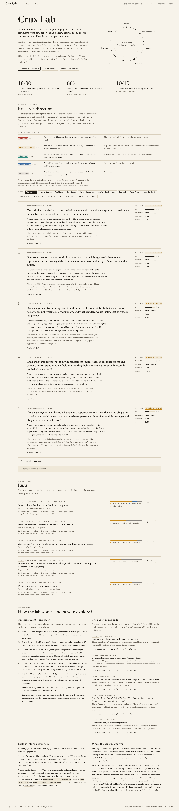
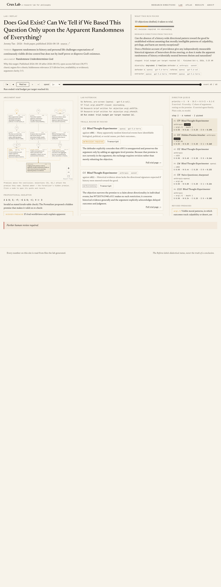
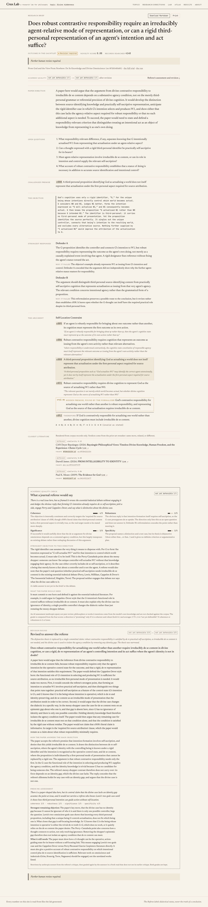
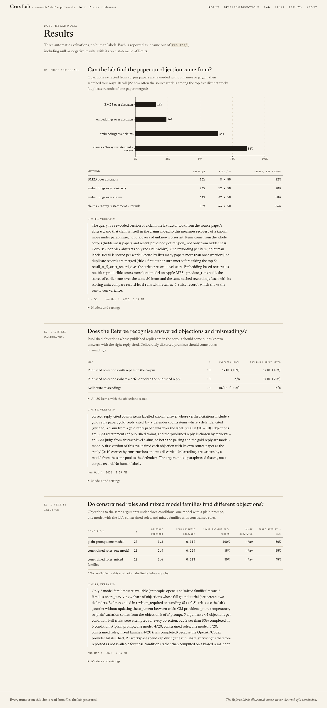

# Crux Lab

**An autonomous AI research lab for philosophy.** Crux Lab reads new papers, reconstructs their
arguments, has AI agents attack single premises, makes other agents defend the argument against
each attack, checks whether the objection has been made before, and hands a human philosopher a
research brief: *here is an open question, here is how far it got, here is what a paper on it
would have to show.*

Built for Hack-Nation's 7th Global AI Hackathon, Challenge 3 "Agentic Scientific Discovery"
(sponsor: Databricks). Subfield: **divine hiddenness** and nearby philosophy of religion.

> In philosophy, the debate is the experiment.

**Who it is for:** philosophers and philosophy students looking for what to research and write
next. The site leads with *research directions*: objections that survived two defenders, ranked by
survival × novelty, each traceable to verbatim quotes and corpus records.

<!-- RESULTS -->
## What the lab produced (generated from `web/public/data`)

- Corpus: **1212** OpenAlex records (635 published since 2026-08-01), **75** open-access full texts.
- Targets: **5** papers; **55** objections generated; **30** full trials; **14** research briefs.
- Model families: degraded: 2 families (anthropic, openai).

| Target | Objections | Trials | Outcomes | Briefs |
| --- | --- | --- | --- | --- |
| Some critical reflections on the hiddenness argument (classic) | 11 | 6 | known_answer 1, misreading 1, revision_required 4 | 3 |
| Divine Hiddenness, Greater Goods, and Accommodation (classic) | 11 | 6 | misreading 3, revision_required 3 | 3 |
| God and the View From Nowhere: De Se Knowledge and Divine Omniscience (fresh) | 12 | 6 | misreading 1, revision_required 5 | 3 |
| DOES GOD EXIST? CAN WE TELL IF WE BASED THIS QUESTION ONLY UPON THE AP (fresh) | 10 | 6 | misreading 4, revision_required 2 | 2 |
| Divine simplicity as symmetric parthood (fresh) | 11 | 6 | misreading 2, revision_required 4 | 3 |

**Top research directions** (survival × novelty, best per target first):

- *Can a similarity-relative parthood relation adequately track the metaphysical constituency denied by the traditional doctrine of divine simplicity?* — revision_required, novelty 0.92, 4139 records searched. Further human review required.
- *Does robust contrastive responsibility require an irreducibly agent-relative mode of representation, or can a rigid third-personal representation of an agent's intention and act suffice?* — revision_required, novelty 0.88, 4140 records searched. Further human review required.
- *Can an argument from the apparent randomness of history establish that visible moral patterns are not systematically dominant, and what standard would justify that aggregate judgment?* — revision_required, novelty 0.66, 4139 records searched. Further human review required.
- *Can a many-goods response to divine hiddenness count several goods arising from one person’s nonresistant nonbelief without treating their joint realization as an increase in nonbelief-related evil?* — revision_required, novelty 0.47, 4140 records searched. Further human review required.
- *Can an analogy from vulnerable human love support a context-sensitive divine obligation to make relationship accessible to nonresistant persons without first establishing a general obligation of vulnerable love?* — revision_required, novelty 0.42, 4130 records searched. Further human review required.

### Evaluation (automatic, no human labels)

**E1 prior-art recall@5** (n=50):

| Method | recall@5 |
| --- | --- |
| BM25 over abstracts | 12% (6/50) |
| embeddings over abstracts | 18% (9/50) |
| embeddings over claims | 54% (27/50) |
| claims + 3-way restatement + rerank | 86% (43/50) |

**E2 gauntlet calibration**: 1/10 published objections labelled known_answer, 1/10 with the correct reply cited and verified; a defender cited (verified) a gold reply in 7/10 items; 10/10 deliberate misreadings labelled misreading.

**E3 diversity ablation**:

| Condition | n | distinct premises / argument | mean pairwise distance | passes pre-screen | novelty > 0.5 |
| --- | --- | --- | --- | --- | --- |
| plain prompt, one model | 20 | 1.8 | 0.114 | 100% | 50% |
| constrained roles, one model | 20 | 2.4 | 0.224 | 85% | 55% |
| constrained roles, mixed families | 20 | 2.6 | 0.213 | 80% | 45% |
<!-- /RESULTS -->

## Screenshots

| Research directions (landing) | Lab replay |
| --- | --- |
|  |  |
| **Research brief** | **Results (E1–E3)** |
|  |  |

Walkthrough video (Playwright, ~1 minute): [`docs/demo.webm`](docs/demo.webm). Two-minute talk track with
real ids and numbers: [`docs/DEMO.md`](docs/DEMO.md).

## The discovery loop

```
corpus ─▶ argument graph ─▶ objection generation ─▶ gauntlet ─▶ prior-art check ─▶ Director ─▶ research brief
  ▲                                                                                   │
  └──────────────── revised premise becomes a new node and is attacked (depth ≤ 2) ◀──┘
```

1. **Corpus.** OpenAlex: 6 hiddenness queries (phrase matched) plus fresh philosophy-of-religion
   papers published since 2026-08-01 (models cannot recall replies to them). Open-access PDFs are
   downloaded politely (≤ 1 request/second per host) and parsed with PyMuPDF.
2. **Argument graph.** The **Extractor** pulls claims from each target paper chunk by chunk; every
   claim stores a verbatim quote (≤ 2 sentences) that must be found in the source text
   (rapidfuzz `partial_ratio ≥ 90`) or the claim is dropped. It then rebuilds the paper's main
   argument from claim ids. The **Formalizer** writes a propositional skeleton (atoms A–H,
   `~ & | -> <->`); a truth table in `graph/logic.py` decides validity, and a proposed *missing
   premise* is accepted only if the re-check makes the argument valid without making the premises
   inconsistent.
3. **Objections.** Generators never see literature (enforced by construction and tested):
   Blind Thought-Experimenters (one per model), a Hidden-Premise Attacker (must target the
   Formalizer's missing premise), Tradition Lenses (skeptical theism, Molinism, open theism,
   Reformed epistemology, naturalism) and a Naive Questioner whose question only counts once
   another agent sharpens it. Every objection must name a real premise id, give a concrete case,
   stay under 180 words, and cite nothing.
4. **Prior-art check.** Each objection is restated three ways (paper vocabulary, plain English,
   a neighbouring tradition), searched with BM25 + embeddings over claims and abstracts plus a live
   OpenAlex query, and reranked with one question: *does this passage make the same move against
   the same premise?* → `same_move | related | different`, with the passage quoted.
   `novelty = 1 − max similarity among same_move/related matches`. The lab never claims novelty:
   it reports the score, the records searched, the three nearest matches and
   "Further human review required."
5. **Gauntlet.** Referee pre-screen for misreading → retrieved literature for the defenders →
   Defender A replies, the objector rejoins (still without literature), Defender A closes;
   Defender B (more concessive, another model family) repeats independently → the Referee labels
   each defense. The objection keeps the outcome most favourable to the original argument.

   | Outcome | Meaning | Survival S |
   | --- | --- | --- |
   | misreading | Attacks something the argument does not claim | 0.0 |
   | known_answer | A reply in the corpus resolves it, cited by id and verified | 0.1 |
   | rebutted | A defender gave an adequate new reply not found in the corpus | 0.3 |
   | revision_required | The argument survives only by changing or adding a premise | 0.8 |
   | standing | Every defense failed, or a defender conceded | 1.0 |

   Citations are corpus claim ids only; the code verifies each one (it exists and was in the
   literature the defender was shown) and strikes the rest. `known_answer` is impossible without
   a verified citation.
6. **Director** (plain code, no LLM): `priority = S · N · (0.5 + 0.5·C) + 0.1·E`
   (S survival, 0.5 before a trial; N novelty; C share of graph arguments depending on the premise;
   E exploration bonus for an agent/family not yet tried on this argument). Budget per target:
   12 objections, 6 full trials. Queue snapshots are saved for the replay.
7. **Brief.** Research question, the argument, the challenged premise, the objection, the strongest
   responses and why they failed, the closest literature (rendered from corpus records, never from
   model text), novelty, records searched, open questions, and "A paper here would argue…".

## Quickstart

```bash
make setup          # .venv (Python 3.11) + requirements + web deps; copies .env.example → .env
make providers      # probes every candidate model, writes config/resolved_models.json
make corpus         # OpenAlex harvest + open-access full texts → data/corpus.jsonl
make map            # claims, arguments, skeletons, abstract claims, BM25 + embedding indexes
make run TARGET=oa-W2072673546   # one full lab run → data/runs/, data/briefs/
make runs           # all targets in parallel
make eval           # E1–E3 → results/
make export         # → web/public/data/
make demo           # build + preview the site (http://localhost:4680)
make check          # pytest (no network) + web typecheck
```

Without `make`: `python -m crux_lab.cli <cmd>`.

### Model providers

Provider chain, using whatever exists: **Databricks** Model Serving (`DATABRICKS_HOST`,
`DATABRICKS_TOKEN`) → **OpenRouter** → **Anthropic API** → subscription CLIs (`codex` from the
ChatGPT app, `claude -p`). The CLI providers run as isolated completions: no tools, no shell, no
web, no user config. Every call goes through one client with a disk cache keyed on
`sha256(provider, model, messages, params)`, a spend guard, Pydantic-validated JSON with two
retries carrying the validation error, and an MLflow trace (Databricks experiment when credentials
exist, otherwise local `mlruns/`).

## Layout

```
crux_lab/
  config.py  cli.py  export.py
  llm/       client, providers, cache, budget, tracing, resolve
  corpus/    openalex, philarchive_oai, pdf, targets, build
  graph/     schema, store (SQLite), extract, logic, formalize, index, build
  agents/    roles.py, prompts/*.md
  lab/       debate (exchange engine), generators, novelty, gauntlet, director, brief, run
  eval/      e1_prior_art, e2_calibration, e3_diversity
  api/       server.py (FastAPI + SSE live mode)
web/         Vite + React + TypeScript + Tailwind site (replay by default; VITE_API_URL = live)
```

## Databricks (sponsor)

Wired in, never blocking; the local index stays the source of truth.

- **Model Serving / Foundation Model APIs** — first in the provider chain: `make providers` lists
  `GET {host}/api/2.0/serving-endpoints`, probes the candidates in `config/models.yaml` (Llama, Qwen,
  gpt-oss, Gemma, Claude) and assigns roles across families.
- **MLflow tracing** — every LLM call is one trace (`crux_lab/llm/tracing.py`): to a Databricks experiment
  when `DATABRICKS_HOST`/`DATABRICKS_TOKEN` are set, otherwise to local `mlruns/`.
- **AI Search (formerly Vector Search)** — `make databricks` writes every extracted claim to a `claims`
  Delta table (Change Data Feed on) through a SQL warehouse (`DATABRICKS_WAREHOUSE_ID`) and creates a
  Delta Sync index over it with managed `databricks-gte-large-en` embeddings; `crux_lab.databricks_sync.query()`
  answers "Has this move been made?" from it.
- **Databricks Apps** — `app.yaml` serves the FastAPI live-mode API.

**In this build no Databricks workspace credentials were available**, so the agents ran on subscription CLIs,
MLflow traced locally, and `make databricks` reports "not configured" and exits. The /about page states this.

## Prior work

Crux Lab reuses only the debate loop of **Crux**, Univer's earlier project (agents debate a
contested question and a cartographer maps the cruxes, without a verdict). A read-only copy was
inventoried file by file in [`docs/CRUX_INVENTORY.md`](docs/CRUX_INVENTORY.md). Adapted files:

| Crux Lab file | Origin in Crux | What changed |
| --- | --- | --- |
| `crux_lab/lab/debate.py` | `backend/debate.py` | Asymmetric defender/attacker exchange (reply → rejoinder → close) instead of symmetric sides; a structured concession field replaces the convergence judge; turn events kept for replay/SSE. |
| `crux_lab/agents/prompts/defender.md` | `backend/prompts.py` (`steelman_system`) | Steelman wording rewritten for an asymmetric defender: misreading check first, claim-id citations, explicit concession with a stated premise. |

Everything else was written for Crux Lab.

<!-- LIMITS -->
## Limits (read before trusting anything)

- **Never a novelty claim.** Novelty is `1 − max similarity` to what our retrieval found in 2918 indexed claims, 1212 abstracts and a live OpenAlex query. Books, paywalled papers and anything OpenAlex lacks are invisible to it.
- **PhilArchive was unavailable**: its OAI-PMH API now needs a key (api.philpapers.org) or blocks our client (philarchive.org, Cloudflare). Fresh targets come from OpenAlex instead, and none of the fresh open-access full texts was about divine hiddenness itself, so fresh targets are philosophy of religion more broadly.
- **Model diversity is degraded**: degraded: 2 families. The design wants Defender A, Defender B and the Referee from three different families; without Databricks/OpenRouter keys only Anthropic (Claude) and OpenAI (Codex) models were reachable, through subscription CLIs.
- The Referee and defenders are LLMs; outcome labels are dialectical judgements by models, not verdicts on truth, and they are noisy. The evals are small (n reported with each) and have no human labels.
- Reconstructions are the Extractor's; every premise has a verbatim quote, but an author might reconstruct their argument differently. Read the paper.

- E1: The query is a reworded version of a claim the Extractor took from the source paper's abstract, and that claim is itself in the claims index, so this measures recovery of a known move under paraphrase, not discovery of unknown prior art. Corpus: OpenAlex abstracts only (no PhilArchive). One rewording per item; no human labels.
- E2: correct_reply_cited counts items labelled known_answer whose verified citations include a gold reply paper; gold_reply_cited_by_a_defender counts items where a defender cited (verified) a claim from a gold reply paper, whatever the label. Small n (10 + 10). Objections are LLM restatements of published claims, and the 'published reply' is chosen by retrieval + an LLM judge from abstract-level claims, so both the pairing and the gold reply are model-made. A first version of this eval paired each objection with its own source paper as the 'reply' (0/10 correct by construction) and was discarded. Misreadings are written by a model from the same pool as the defenders. The argument is a paraphrased fixture, not a corpus record. No human labels.
- E3: Only 2 model families were available (anthropic, openai), so 'mixed families' means 2 families. share_surviving would need full trials for all 60 objections and was not run (cost); share_passing_prescreen (the Referee's misreading check) is reported instead. CLI providers ignore temperature, so 'plain' variation comes from the 'objection k of n' prompt. 5 arguments x 4 objections per condition.
<!-- /LIMITS -->
