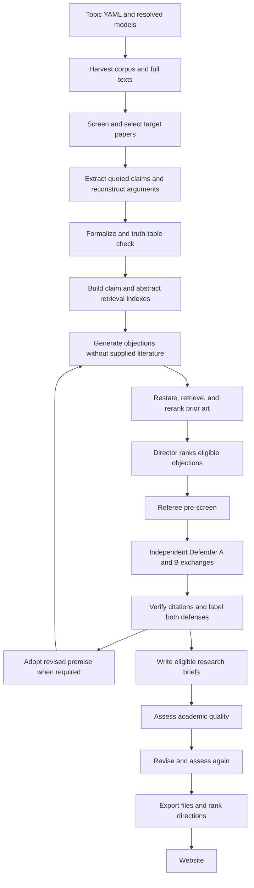

# Crux Lab: built features and processes

This document describes the implementation in this repository as inspected on **4 October 2026**. It covers the website, the Python lab that generates its content, the saved results, and the operational workflows. Descriptions are based on source code and the files in `web/public/data`, rather than treating the original project specification as a list of completed features.

The numerical snapshot below comes from the exported files, which were generated on 4 October 2026. These are saved experiment results, not counters from a running service. This documentation review did not rerun model experiments, publish the website, or test external provider availability.

## Contents

1. [What was built](#1-what-was-built)
2. [What the current site contains](#2-what-the-current-site-contains)
3. [Every page and its features](#3-every-page-and-its-features)
4. [Shared website behavior](#4-shared-website-behavior)
5. [Complete research process](#5-complete-research-process)
6. [Scoring and interpretation](#6-scoring-and-interpretation)
7. [Data, storage, and export](#7-data-storage-and-export)
8. [Live API](#8-live-api)
9. [Model infrastructure](#9-model-infrastructure)
10. [Databricks integrations](#10-databricks-integrations)
11. [Running, refreshing, and deploying the project](#11-running-refreshing-and-deploying-the-project)
12. [Evaluations, tests, and audits](#12-evaluations-tests-and-audits)
13. [Implementation boundaries and limitations](#13-implementation-boundaries-and-limitations)
14. [Concrete implementation inventory](#14-concrete-implementation-inventory)

## 1. What was built

Crux Lab is a research-direction generator for philosophers and philosophy students. It takes an argument from a paper, produces objections against particular premises, tests those objections against two AI defenders, searches for similar moves in the literature, and produces a research brief explaining a possible paper to write next.

The repository contains three connected products:

| Built part | Concrete behavior | Output |
| --- | --- | --- |
| Python research lab | Harvests papers, extracts quoted claims, reconstructs and formalizes arguments, generates objections, runs trials, searches prior art, writes and grades directions | Corpus records, SQLite objects, indexes, timestamped run events, JSON and Markdown briefs, evaluation files |
| Browser website | Presents ranked directions, source evidence, argument maps, trial transcripts, replay controls, topic templates, and evaluation results | A Vite production build that reads exported data files |
| Optional FastAPI service | Streams saved runs or explicitly requested fresh experiments, and searches the local hybrid claim index | Server-sent events and JSON responses |

The default website works from saved files. Opening a brief, playing a replay, switching topics, or searching the exported claims does not call a language model. Running the lab and updating its public results are separate operations.

The intended final artifact is a **research proposal with evidence and objections**, rather than a completed academic paper. Trial outcomes describe how an argument fared in a model discussion. They do not decide whether its conclusion is true.

Sources: [website routes](../web/src/App.tsx), [run orchestrator](../crux_lab/lab/run.py), [exporter](../crux_lab/export.py), [API](../crux_lab/api/server.py).

## 2. What the current site contains

### Topic snapshot

| Metric | Divine hiddenness | Decision theory in philosophy of religion |
| --- | ---: | ---: |
| Corpus records | 1,212 | 648 |
| Distinct works within that topic | 962 | 561 |
| Records with abstracts | 1,212 | 648 |
| Available full texts recorded by the lab | 75 | 50 |
| Records marked fresh | 635 | 99 |
| Target papers with saved runs | 5 | 6 |
| Generated objections | 55 | 72 |
| Trials | 30 | 36 |
| Ranked research briefs | 14 | 18 |
| Exported claims, including generated premises | 2,940 | 1,712 |
| Full-text claims | 303 | 391 |
| Abstract claims | 2,615 | 1,291 |
| Generated claims | 22 | 30 |
| Reconstructed arguments in the Atlas | 5 | 12 |
| Support / attack edges in the export | 44 / 19 | 84 / 19 |
| Model families recorded for the topic | 2 | 8 |
| Evaluations available | E1, E2, E3 | E1 |

Across the two explored topics there are **11 runs, 127 objections, 66 trials, and 32 ranked briefs**. Work counts are deduplicated within each topic; adding them would not establish a count of unique works across both topics.

The third configured topic, **the fine-tuning argument**, has a topic definition and can be used as a template, but has no exported run results.

Divine hiddenness records Anthropic and OpenAI families. Decision theory records Anthropic, Kimi, GLM, Mistral, Qwen, Llama, gpt-oss, and Gemma. Both topics record local `bge-small-en-v1.5` embeddings.

### What the trials actually produced

| Outcome | Divine hiddenness | Decision theory |
| --- | ---: | ---: |
| Misreading | 11 | 9 |
| Known answer | 1 | 0 |
| Rebutted | 0 | 0 |
| Revision required | 18 | 27 |
| Standing | 0 | 0 |

Every saved run reached six trials. The main run exports contain no failed trials in this snapshot, although failed trials exist in the diversity evaluation and the code explicitly supports them.

The Assessor originally graded all 32 ranked briefs **not yet defensible**. After revision, 4 are **needs work** and 28 remain **not yet defensible**. None is graded **promising**. A direction can rank first while still having serious academic weaknesses.

One decision-theory objection has a failed reranker check and appears as **not assessed**. It is excluded from the Director's scored queue; the other 71 objections in that topic have assessed novelty.

### Saved paper experiments

These are the papers with exported runs, rather than hypothetical examples:

| Topic | Paper | Target kind | Objections / trials / briefs |
| --- | --- | --- | --- |
| Divine hiddenness | Some critical reflections on the hiddenness argument | Classic | 11 / 6 / 3 |
| Divine hiddenness | Divine Hiddenness, Greater Goods, and Accommodation | Classic | 11 / 6 / 3 |
| Divine hiddenness | God and the View From Nowhere: De Se Knowledge and Divine Omniscience | Fresh | 12 / 6 / 3 |
| Divine hiddenness | DOES GOD EXIST? CAN WE TELL IF WE BASED THIS QUESTION ONLY UPON THE APPARENT RANDOMNESS OF EVERYTHING? | Fresh | 10 / 6 / 2 |
| Divine hiddenness | Divine simplicity as symmetric parthood | Fresh | 11 / 6 / 3 |
| Decision theory | A Theological Argument for an Everett Multiverse | Classic | 12 / 6 / 3 |
| Decision theory | Faith as doxastic venture | Classic | 12 / 6 / 3 |
| Decision theory | The philosopher’s paradox: How to make a coherent decision in the Newcomb Problem | Classic | 12 / 6 / 3 |
| Decision theory | Surreal decisions | Classic | 12 / 6 / 3 |
| Decision theory | Saving Eternity (and Divine Foreknowledge and Free Will): A Reply to Hasker | Classic | 12 / 6 / 3 |
| Decision theory | Pascal’s Wager and Its Postmodern Counterpart | Classic | 12 / 6 / 3 |

Sources: [topic registry export](../web/public/data/topics.json), [default index](../web/public/data/index.json), [default corpus and model metadata](../web/public/data/about.json), [decision-theory index](../web/public/data/topics/decision-theory/index.json), [decision-theory metadata](../web/public/data/topics/decision-theory/about.json), and the corresponding `claims.json`, `briefs.json`, and `runs/*.json` files.

## 3. Every page and its features

Routes below are relative to the website's base path. GitHub Pages builds use `/crux-lab/`; local builds use `/` by default.

| Route | Purpose | Implementation |
| --- | --- | --- |
| `/` | Main introduction, strongest lead, research directions, and run overview | [Landing.tsx](../web/src/pages/Landing.tsx) |
| `/topics` | Browse explored and configured topics and switch the dataset | [Topics.tsx](../web/src/pages/Topics.tsx) |
| `/start` | Generate a topic YAML file and learn how to run it | [Start.tsx](../web/src/pages/Start.tsx) |
| `/lab` | Redirect to the first exported run, or show an empty state | [LabIndex.tsx](../web/src/pages/LabIndex.tsx) |
| `/lab/:run` | Replay one paper's research process | [Lab.tsx](../web/src/pages/Lab.tsx) |
| `/trial/:id` | Read one objection's complete recorded trial | [Trial.tsx](../web/src/pages/Trial.tsx) |
| `/briefs` | Browse all ranked research directions | [Briefs.tsx](../web/src/pages/Briefs.tsx) |
| `/brief/:id` | Read, print, or download one research brief | [Brief.tsx](../web/src/pages/Brief.tsx) |
| `/atlas` | Search and inspect the exported claims and arguments | [Atlas.tsx](../web/src/pages/Atlas.tsx) |
| `/results` | Inspect automatic evaluation results and their limits | [Results.tsx](../web/src/pages/Results.tsx) |
| `/about` | Explain the method, agents, providers, corpus, and integration status | [About.tsx](../web/src/pages/About.tsx) |
| Any other route | Show “Not in the notebook” and a link home | [NotFound.tsx](../web/src/pages/NotFound.tsx) |

### 3.1 Landing page: `/`

The home page combines an introduction with actual research outputs:

- A product explanation, the selected topic and area, and the number of fresh versus older targets.
- An SVG discovery-loop ring illustrating the conceptual method. This is an explanatory graphic, not a control that runs an experiment.
- Links to research directions, the explanation of the process, and the lab replay.
- Up to three headline statistics calculated during export, each with its source label. Depending on available data, these include surviving/revision-forcing trials, the best E1 recall, caught misreadings, or the number of briefs.
- A **strongest lead** card for the first ranked brief. It uses the revised question and direction when those exist, and displays the latest Assessor grade, survival, novelty, quality, and lead score.
- The next four ranked directions, making five featured directions in the unfiltered view.
- Paper-filter buttons. Selecting a paper shows all of its directions and hides the global strongest-lead card. The filter on this page is local component state.
- A link to the full list when there are more than five directions.
- An outcome guide and the human-review statement.
- A run list showing each paper, target kind, argument title, objection/trial/brief counts, model families, completion time, stop reason, outcome distribution, and replay link.
- A “How it works” section explaining one-paper experiments, listing target papers with links to their directions and replays, explaining the corpus, and linking to topic creation and the Atlas.

Selecting a paper from the explanation section also scrolls to the direction filter. Headlines and result counts come from the selected topic's exports.

### 3.2 Topic browser: `/topics`

Each configured topic appears with its name, description, area, search phrases, and objection traditions. Cards distinguish **explored** topics from **configured, not run yet** topics and identify the currently selected topic.

For an explored topic, the page displays run counts, literature work count, model families, and its strongest lead with novelty, quality, and lead score. The current topic links directly to its brief. Another explored topic has an **Explore this topic** button that switches the whole site to that dataset.

Every card has **Use as a template**, linking to `/start?from=<slug>`. Unrun topics expose the repository config path and an expandable command sequence for running them. The page also links to starting a new topic.

Topic selection happens before the application renders:

1. Load the site-wide `topics.json`.
2. Prefer the `?topic=<slug>` URL value; otherwise use the value remembered in `sessionStorage` under `crux-lab-topic`.
3. Select a ready topic matching that request; otherwise fall back to the ready default topic or the first ready topic.
4. Set the topic's data prefix and remember the selection for the browser session.

Switching topics reloads the application at its base URL with the new topic query parameter. An unrun topic cannot be selected as a results dataset. A shared link to a nondefault topic should include `?topic=<slug>`, including on a brief or trial route.

Implementation: [topic boot and switching](../web/src/lib/topics.ts), [data prefixing](../web/src/lib/data.ts).

### 3.3 Topic creator: `/start`

This is a browser-based **configuration generator**. It does not run the research lab or write files into the repository.

The form supports:

| Field | What it controls |
| --- | --- |
| Topic name | Name shown on the site |
| Short ID | Slug used in filenames, topic selection, and commands |
| Area | Field supplied to screening and assessment prompts |
| Description | Human explanation of the topic |
| Search phrases, one per line | OpenAlex searches |
| On-topic keywords, comma separated | Regular expression for keeping relevant records |
| Three relevance descriptions | The meanings of screening levels 1, 2, and 3; level 0 is unrelated |
| Traditions, one per line | Schools used by Tradition Lens generators |
| Fresh-from date | Publication cutoff for fresh searches |

The page can start blank or copy one of the three configured topics. `?from=<slug>` prefills a template. The slug is derived from the name unless the user has customized it; it is sanitized and capped at 40 characters.

The YAML preview updates as fields change. Ordinary search phrases are wrapped for phrase matching; phrases containing quotes, parentheses, or `AND`/`OR`/`NOT` are passed through. Keywords become an alternation regex, with escaping for ordinary text and limited support for regex-like input. JSON string serialization supplies YAML-compatible quoting.

Users can **copy** the YAML or **download `<slug>.yaml`**. The generated file includes commented examples for target counts, target spreading, and stricter fresh-paper filtering. Empty fields receive defaults; this is not a comprehensive configuration validator.

The accompanying steps explain cloning and setup, configuring a provider, saving the YAML under `config/topics`, running corpus → targets → map → runs → export, opening the site, checking selected papers, and supplying a manual argument. The form state is held in memory and is not saved as a user account draft.

### 3.4 Lab replay: `/lab/:run`

The run page is a three-pane record of the lab's work on one paper.

**Paper and final-result summary**

The header shows the paper title, authors, year, fresh/classic/manual status, source link, thesis, reconstructed argument, and reason it was selected. It also shows final objection/trial counts, outcome distribution, research briefs, stop reason, completion time, diversity status, and role/model badges. A dropdown switches between exported runs.

This final summary is independent of the replay position. It can describe the completed run while the panes are still replaying its first events.

**Replay transport**

- Jump to start, step backward, play/pause, step forward, and jump to end.
- A slider for selecting the event position, plus `event <position> / <total>`.
- Speeds of **0.5×, 1×, 2×, 4×, and 8×**.
- Space to play/pause and left/right arrow keys to step, when focus is outside interactive controls and dialogs.
- `/lab/<run>?at=end` to open the completed view.
- `?speed=<supported speed>` to set the initial playback speed.
- Autoplay from the start by default; users preferring reduced motion start at the end without autoplay.
- A short description of the most recent event, announced through an ARIA live region.

Playback uses fixed reading-time delays by event type, rather than reproducing the original experiment's full elapsed time. Seeking reconstructs the visible state by folding the events up to the selected position. Older turn events lacking a trial ID are matched against stored trial rounds to attribute interleaved exchanges correctly.

**Left pane: argument map and objections**

- Premise nodes above a conclusion node, with propositional formulas when available.
- Dashed amber nodes for Formalizer-proposed missing premises and dotted amber nodes for adopted revisions.
- Numbered objection dots attached to the premise they attack. Their color reflects outcomes; active trials have a filled dot and animated attack edge.
- Map pan/zoom controls and automatic fitting as the graph grows. Nodes are fixed and cannot be connected or edited.
- Clicking a premise/conclusion opens its claim drawer. Clicking an objection dot scrolls to that objection's entry.
- The propositional skeleton, validity status, hidden premise explanation, expandable atom dictionary, and textual premise/conclusion list.
- Objections appearing as they are generated, with agent/model, tradition, target, recursion depth, prior-art status, novelty, records searched, and trial status.
- Expandable objection text and its explanation of why the premise fails.
- Links to full trial pages after recorded trials finish.

**Center pane: notebook and trial transcripts**

- A notebook of the five most recent events.
- Trial cards grouped into pre-screen, Defender A exchange, and Defender B exchange.
- Fold/Transcript controls. Active or most recently updated trials expand automatically until the user overrides that state.
- Per-turn speaker, phase, family, model, text, concessions, revised premises, verified citations, and struck citations.
- Completed outcome/error information and links to full trial pages.
- Automatic following of the active transcript on wide screens during playback or streaming.

**Right pane: Director**

- The latest queue snapshot, step number, ranked count, and picked count.
- The priority formula and each candidate's survival, novelty, dependence, exploration bonus, depth, and computed priority.
- Highlights for the objections picked for trial.
- Adopted revised premises.
- Naive questions and whether they were sharpened into counted objections.
- Briefs written so far, plus the recorded end/error state.

On smaller screens the panes stack vertically and map/trials/director anchor links help navigation. Runs with no event log show final map data and a message that there is nothing to replay.

**Optional live control**

Building with `VITE_API_URL` adds **Run live**. This opens an `EventSource` for the target and feeds streamed events into the same pane state. Replay transport is disabled while streaming; connection states include connecting, streaming, done, and error. **Back to replay** closes the connection and restores the saved replay.

The current button does **not** send `fresh=true`. It streams the server's existing run. A genuinely fresh experiment requires an explicit API request; see [section 8](#8-live-api).

Implementation: [LabPanes.tsx](../web/src/components/LabPanes.tsx), [ArgumentMap.tsx](../web/src/components/ArgumentMap.tsx), [replay state](../web/src/lib/replay.ts).

### 3.5 Full trial: `/trial/:id`

The page locates a trial by inspecting the exported run index, trying the likely source-paper run first and then other runs. It has explicit loading and trial-not-found states.

A trial displays:

- Its objection agent, target premise, trial ID, and combined outcome.
- The Referee's rationale in plain words and the deciding quotation.
- A required revised premise, if one was recorded.
- The complete objection, target text, kind, tradition, depth, generator family/model, and reason the premise fails.
- The prior-art result: score or not-assessed reason, records searched, passages reranked, OpenAlex search status, three restatements, and nearest matches.
- The pre-screen turn and separate Defender A and B exchanges.
- Each defender's label, rationale, deciding quote, revised premise, and verified/struck citation lists.
- The combined verified citation IDs.
- Links to the brief when one exists and back to the completed run.

A failed trial is explicitly labeled **Failed**, displays its error or missing defender labels, and has no combined result. Whatever discussion was recorded remains readable.

### 3.6 Research-direction list: `/briefs`

This page shows the eligible briefs in exporter-computed lead-score order. Each row contains the research question, a shortened paper direction, revised question when available, latest Assessor summary, challenged premise, source paper, outcome, quality, novelty meter, records searched, survival, and lead score.

The best direction within each paper receives a “top direction for this paper” label. Filters preserve the original global rank numbers:

- **Paper filter:** stored in the URL as `?paper=<run ID>`, allowing a paper-specific list to be shared. Existing URL parameters are preserved.
- **Outcome filter:** local component state, shown when multiple outcomes exist in the list.

Empty datasets and no-match filters have explicit messages. Each row opens the full brief.

### 3.7 Research brief: `/brief/:id`

The brief is the main reader-facing research artifact. It includes:

1. Research question, trial outcome, novelty, records searched, rank, and lead score.
2. Source paper and links to the full trial and completed run.
3. A quality strip showing the original and revised grades when available.
4. “A paper here would argue…” direction and open questions.
5. Challenged premise and the objection.
6. Strongest defender responses and why the brief says they fell short.
7. The reconstructed argument: premise IDs and text, source quotations, highlighted challenged premise, any hidden premise, conclusion, formal skeleton, and validity status.
8. Closest literature with titles, authors, years, links, reranker verdicts, similarity, quotations, and clickable record/claim IDs.
9. The full academic-quality assessment: four criterion scores and reasons, summary, strongest objection, whether a reply is available, what the paper needs, and Assessor model.
10. A revision panel: what changed, whether the thesis narrowed, revised question/direction, answer to the main objection, fresh assessment, and remaining weaknesses.
11. The human-review statement.

**Download Markdown** fetches the prewritten `.md` counterpart and triggers a browser download. It reports when that file was not exported. **Print** calls the browser print dialog; print styles hide navigation, footer, drawers, and controls and use a white page.

The original question and proposal remain visible alongside the revision. References are assembled from stored records, not invented bibliographic text supplied by the brief-writing model.

### 3.8 Atlas: `/atlas`

The Atlas exposes the retained claim collection and reconstructed arguments. Its summary displays total claims, papers with claims, argument count, and counts for each exported edge relation.

**“Has this move been made?” search**

- Accepts an objection or reply in a textarea; requires at least three nonwhitespace characters.
- Defaults to browser-local BM25 over exported claim text **and quotations**.
- Retrieves up to 60 candidates and returns up to 10 results, one per distinct work using the exported `work` identifier.
- Shows rank, retrieval score, claim kind, clickable ID, text, paper title/year, number of claims searched, and search mode.
- Provides a no-results message and an error state for failed live requests.
- When an API is configured, offers **local BM25** and **live index** buttons. Live mode calls the server's BM25-plus-embeddings index; it does not run the full novelty reranker.

Retrieval scores in this box are search scores, not novelty scores or verified “same move” judgments.

**Argument graphs**

Tabs select one reconstructed argument at a time. The graph shows premises, conclusion, formulas, and a dashed hidden premise, with zoom/fit controls and the skeleton/validity below it. The Atlas graph does not pass the claim-click drawer handler used by the Lab graph; source inspection is available through search results and the claim list.

**Claim index**

- Text filter matching claim text, ID, or quotation, case-insensitively.
- Kind filter for the kinds present in the export.
- Source-level filter for `fulltext`, `abstract`, or `generated`, when present.
- Filtered/total count, clickable IDs, kind, level, text, and paper title.
- An initial 60 rows; **Show more** adds 120 rows at a time. Changing a filter resets the limit.

The page shows argument-sized diagrams and a searchable collection. It does not render every corpus claim and relation as one global graph.

### 3.9 Results: `/results`

The page has three evaluation sections, all described as automatic evaluations without human labels.

- **E1 prior-art recall:** horizontal Recharts bar chart, percentages, hit counts, distinct-work recall@5, and stricter per-record recall. Chart labels adapt on narrow screens; animations are disabled.
- **E2 gauntlet calibration:** a table of answered-objection labels, correct reply citations, reply citations by a defender regardless of final label, and caught deliberate misreadings. An expandable item list shows objections, correctness, outcomes/failures, and clickable source/reply IDs.
- **E3 diversity ablation:** a table comparing plain single-model, constrained single-model, and constrained mixed-family conditions. It reports sample count, premise coverage, pairwise distance, pre-screen pass rate, survival availability, and novelty share.

Every available evaluation includes its stored limits statement, run timestamp, and expandable model/settings metadata. Missing evaluations are explained. In this snapshot, decision theory has no E2 fixture/results and no repeated E3 results.

### 3.10 About: `/about`

The About page explains the method and displays the selected topic's actual provider and corpus metadata:

- Model-family count, full/degraded diversity status, and the requirement for independent families where available.
- Discovery-loop graphic and stage descriptions.
- Roles and constraints for extraction, formalization, objection generators, defenders, Referee, prior-art checking, Director, and Assessor.
- Definitions of the five trial outcomes and how the two defenses are combined.
- Role-to-model/provider assignments, plus an expandable list of all probed candidate models and whether each probe succeeded.
- Databricks serving/search/tracing/App explanations and status indicators derived from the export.
- Corpus statistics, target-selection notes, and expandable mapping statistics.
- Technology stack, generated method notes, duplicate-work explanation, outcome skew, novelty calibration where available, and methodological limits.

These statuses are exported snapshots, not live monitoring. In particular, a local embedder is shown as local index use; that display does not establish that a remote Databricks Delta Sync index was deployed or queried.

## 4. Shared website behavior

### Concrete reader workflow

A researcher can follow the evidence behind a saved direction without running the lab:

1. Open the home page for divine hiddenness and read its strongest lead about agent-relative representation and contrastive responsibility.
2. Open `/brief/brief-W7203485685.arg1.ofd28a0` to read the proposal, challenged premise, source quotations, strongest replies, closest literature, and original/revised grades.
3. Follow its full-trial link to `/trial/trial-W7203485685.arg1.ofd28a0` and inspect the two independent defenses and Referee reasoning.
4. Click a verified claim ID or literature record to inspect its quotation, paper metadata, and source link in a drawer.
5. Follow the run link to `/lab/run-oa-W7203485685?at=end`; restart or step through it to see when the objection was generated, selected, debated, and converted into a brief.
6. Use the Atlas to search a related move in the exported literature, then download or print the brief for further human research.

The underlying artifacts are the [saved brief](../web/public/data/briefs/brief-W7203485685.arg1.ofd28a0.json) and [saved run](../web/public/data/runs/run-oa-W7203485685.json). A nondefault-topic equivalent requires its topic query parameter, for example `/brief/brief-W4394980009.arg1.o6ef874?topic=decision-theory`.

### Navigation and layout

The shared header links to Topics, Research directions, Lab, Atlas, Results, and About. The logo returns home; the topic indicator links to topic selection. Active navigation links are underlined. Page-path changes scroll to the top.

Pages are lazy-loaded through React `Suspense`. The loading label is “Opening the notebook…”. A shared footer says numbers come from generated files and that the Referee labels dialectical status.

The design uses paper/ink colors, Newsreader serif text with Georgia fallbacks, JetBrains Mono for model turns and technical metadata, thin rules, marginal labels, and consistent outcome colors. Responsive grids stack content on smaller screens.

### Claim and record drawers

Clickable claim IDs, recognized bracketed citations, Lab map nodes, literature records, and evaluation references can open a right-side drawer.

For a claim it displays the ID, kind, source level, paraphrased text, verbatim quotation, and source record. Generated premises are identified as lab-produced and can have no source quotation.

For a paper record it displays title, authors, year, venue, ID, source, fresh/publication information, an external link, and an expandable abstract. Records and claims are loaded on demand, using a locally supplied claim where the page already has one.

Close button, Escape, or clicking the backdrop dismisses the drawer. Focus moves to the close button when it opens and returns to the initiating element when it closes. The drawer is marked as an ARIA modal dialog; the implementation does not include a full focus-trap mechanism.

Verified citations are clickable. Struck citations use a strikethrough, an explanatory label, and are not clickable. A missing claim/record has an explicit explanatory state.

Implementation: [drawer.tsx](../web/src/components/drawer.tsx), [text.tsx](../web/src/components/text.tsx), [TurnView.tsx](../web/src/components/TurnView.tsx).

### Loading, missing data, and failure display

The shared data loader caches JSON request promises by topic-aware URL, reuses successful reads, and evicts rejected requests. It distinguishes loading, ready, missing, and generic error states.

An HTTP failure, malformed JSON, or an HTML SPA fallback where JSON was expected is treated as missing exported data. Pages explain which file is missing and how `make export` produces it.

Novelty failures show **not assessed**, rather than a numeric bar. Trial failures show **Failed**, preserve recorded evidence, and have no combined outcome. No data is invented to fill an empty page.

### Accessibility and printing

The implementation includes a skip-to-content link, landmark navigation, visible focus styling, labeled inputs, outcome text alongside colors, ARIA state on filters/controls, loading/status live regions, reduced-motion behavior, and print-specific styling. Automated accessibility checks are described in [section 12](#12-evaluations-tests-and-audits); they are not a claim of complete accessibility certification.

## 5. Complete research process

The diagram below follows the **implemented execution order**. The site's conceptual loop ring places “gauntlet” before “prior-art check”, but the run code computes novelty before the Director selects trials, and defenders use the retrieved matches.



A pre-screen misreading ends a trial before the defender exchanges. The revision loop is bounded; it does not continuously expand without limits.

### 5.1 Define the topic

`config/topics/<slug>.yaml` supplies name, description, area, search strings, fresh date/searches, relevance regexes, relevance-level descriptions, schools, optional target-selection settings, and an optional E2 fixture.

Select it with `make ... TOPIC=<slug>`, `CRUX_LAB_TOPIC=<slug>`, or `python -m crux_lab.cli --topic <slug> ...`. Topic paths are resolved when configuration is imported.

The default topic uses the original `data/`, `results/`, and `web/public/data/` locations. Other topics have separate corpus, database, targets, runs, briefs, results, indexes, and web export paths. Downloaded raw texts and the LLM cache are shared.

Implementation: [config.py](../crux_lab/config.py), [topic definitions](../config/topics).

### 5.2 Discover and assign models

`make providers` lists available models/endpoints, matches candidates in `config/models.yaml`, probes candidates with a small completion, and writes `config/resolved_models.json`.

Working models are grouped into families. Defender A, Defender B, and Referee are assigned across the first three available families when possible. With fewer families, different models are used where possible and the build records degraded diversity. Extraction/reranking can use configured bulk families; generators cover available families, and the naive role prefers a small model.

The assignment is resolved before agent calls. This is not automatic cross-provider failover for a failed individual completion.

Implementation: [resolve.py](../crux_lab/llm/resolve.py), [models.yaml](../config/models.yaml).

### 5.3 Build the corpus and download full texts

`make corpus` harvests OpenAlex using the topic's classic and fresh searches. It reconstructs abstracts from OpenAlex's inverted index and records metadata including authors, year, publication date, DOI/URL, venue, PDF URL, citations, and the search that found the record.

Classic records require an abstract of at least 200 characters and a match for the topic's relevance regex. Fresh searches filter by publication date, open access, and abstract availability, then require at least 300 abstract characters and the fresh relevance regex. Records are merged by OpenAlex ID.

Full-text retrieval prioritizes fresh candidates and then highly cited older candidates. The standard builder seeks up to 50 recorded full texts, reserving at most half for fresh candidates. The 75 full texts in the default snapshot reflect the saved project corpus and supplemental work, not a claim that the standard quota is 75.

The downloader checks the PDF signature, rejects bodies over 40 MiB, reuses downloaded files, extracts text with PyMuPDF, cleans line-break hyphenation/spacing, and requires at least 8,000 extracted characters for a usable full text. Raw PDFs and extracted text stay local under `data/raw`.

The HTTP helper enforces roughly one request per second per host within its process, supplies a project User-Agent, uses timeouts, and retries transient failures. OpenAlex live novelty searches have their own disk cache and configurable request cap.

The supplemental [classic_fulltexts.py](../scripts/classic_fulltexts.py) script makes another pass through older open-access candidates, adding up to 25 full texts and rewriting corpus metadata. It explains how the saved default corpus can exceed the standard builder's 50-text quota.

Implementation: [corpus build](../crux_lab/corpus/build.py), [OpenAlex](../crux_lab/corpus/openalex.py), [PDF processing](../crux_lab/corpus/pdf.py), [HTTP helper](../crux_lab/corpus/http.py).

### 5.4 Screen and select target papers

`make targets` considers papers with usable full text. A code check examines text for English-like character/common-word patterns; a model screen judges area relevance, whether the paper argues for a thesis, topic relevance 0–3, argument clarity 0–3, and English.

The default plan requests three fresh and two classic targets. Missing eligible fresh targets are filled by classics. Topics can override counts and minimum fresh relevance and use round-robin spreading across search groups. Ranking uses relevance/clarity, with venue, article type, citation count, or text-length tiebreakers depending on the pool.

The result is `targets.json` with target ID, paper ID, kind, source text path, thesis, screen result, and a concrete selection reason. Markdown files in the topic's `manual_targets/` folder become additional manual targets with their own argument text.

The decision-theory snapshot contains six classic targets, despite having fresh corpus records: corpus freshness does not imply that a fresh paper passed target selection.

Implementation: [targets.py](../crux_lab/corpus/targets.py).

### 5.5 Extract claims and reconstruct arguments

`make map` reads each target's text, strips a late bibliography section when detected, and extracts claims from overlapping chunks. Defaults are 14,000 characters per chunk, 600-character overlap, and at most eight chunks. It therefore does not guarantee processing an arbitrarily long paper in full.

Each proposed claim has a kind, text, and source quotation. Code retains it only when its quote contains at most two detected sentences and can be found in its source chunk after normalization, either exactly or with RapidFuzz partial-ratio similarity of at least 90. Short quotes under 15 normalized characters are rejected. Duplicate normalized claim texts are removed.

The Extractor then reconstructs up to two arguments using the retained claim IDs. Each requires 2–6 premises, a separate conclusion, and IDs actually present in the claim collection. The run engine currently uses the **first** mapped argument for a target, even when the Atlas has two.

Corpus abstracts are processed in batches of eight; up to three quoted claims per abstract are retained using the same source-quote checks. These make the wider literature searchable even where no full text was downloaded.

Already mapped targets and abstracts are skipped on reruns. Extraction statistics record proposed/kept claims and dropped examples.

Implementation: [extract.py](../crux_lab/graph/extract.py), [graph build](../crux_lab/graph/build.py).

### 5.6 Formalize and check validity

The Formalizer maps premise and conclusion text to formulas using atoms `A`–`H`, parentheses, negation, conjunction, disjunction, implication, and equivalence. Code checks formula parsing, declared atoms, and coverage of every premise.

A truth table determines whether the stated premises entail the conclusion. If they do not, the model can propose a missing premise. Code accepts it only when the additional formula makes the argument valid and leaves the premises consistent.

A retained missing premise becomes a generated assumption claim such as `W123.arg1.mp`, with a support edge to the conclusion. It has no source quotation. The argument's `valid` field still describes validity **as stated**, before that repair; a repaired argument can consequently show “invalid as stated” alongside an accepted hidden premise.

This checks a model-written propositional abstraction, not all semantic, modal, quantified, or metaphysical aspects of the original argument.

Implementation: [formalize.py](../crux_lab/graph/formalize.py), [logic.py](../crux_lab/graph/logic.py).

### 5.7 Build retrieval indexes and identify duplicate works

The map stage builds two local collections: extracted full-text/abstract **claims** and paper **abstracts**. Generated premises are stored and exported but are not included in the research pipeline's literature claim index.

Each collection supports BM25 and dense vector retrieval. `HybridIndex.search` combines their rankings through reciprocal-rank fusion. The implemented embedder uses local sentence-transformers `BAAI/bge-small-en-v1.5` where available, or an LSA fallback built from TF-IDF and singular-value decomposition. The index stores vectors, IDs, text, metadata, and the backend label.

Duplicate-work detection uses normalized title plus the first author's surname. It groups different OpenAlex versions of the same paper for nearest matches, manual search results, and work-level evaluation. It is a heuristic, rather than a complete bibliographic entity-resolution system.

Implementation: [index.py](../crux_lab/graph/index.py), [dedup.py](../crux_lab/corpus/dedup.py).

### 5.8 Generate objections

Generators receive the argument's own premises, conclusion, accepted hidden premise, and relevant adopted revisions. Their context builder has no corpus/index/store access. This prevents supplying retrieved literature during generation; it does not erase a model's pretraining knowledge.

| Generator | Concrete behavior |
| --- | --- |
| Blind Thought-Experimenter | Produces a concrete case against a specified premise; first-wave models are assigned different stated premises for coverage |
| Hidden-Premise Attacker | Runs only when a hidden premise exists and must target that premise |
| Tradition Lens | Produces an objection from a declared configured school; two deterministically chosen schools are tried per argument |
| Naive Questioner plus sharpener | Asks a plain question, then another model decides whether it can be sharpened into a usable objection; only a usable sharpened objection counts |

Prompts ask for at most 180 words. The code allows a counting tolerance up to 200, rejects objections under 40 words, enforces an allowed premise ID, checks required target/school, and rejects common citation/date patterns. It does not mechanically prove that a thought experiment is philosophically coherent or detect every possible citation.

The first wave is capped at eight ordinary generator results; a sharpened naive objection can be added when at least two families exist. Later waves and revision attacks fill available slots. Objection IDs include a content/model/agent hash.

Implementation: [generators.py](../crux_lab/lab/generators.py), [prompt files](../crux_lab/agents/prompts).

### 5.9 Check prior art and novelty

For each objection the lab:

1. Requests three restatements: paper vocabulary, plain English, and a neighboring tradition.
2. Searches using the original objection and available restatements against both claim and abstract indexes.
3. Optionally adds one cached live OpenAlex search.
4. Excludes the target paper and detected versions of that same work.
5. Fuses retrieved candidates and sends up to 14 passages to a reranker by default.
6. Requires a judgment for every listed passage: `same_move`, `related`, or `different`, plus similarity and a quotation.
7. Checks quotations against passage text, clamps similarity to the verdict's range, and limits unsupported high-similarity judgments.
8. Returns the three closest matches from distinct works, the full match list, search/rerank counts, restatements, score, and status.

Novelty is `1 - highest similarity` among same/related matches. If there are no same/related matches, the highest similarity among the other judged passages is used. This avoids assigning a free maximum score simply because all verdicts were “different”.

No candidates, invalid reranker output after retries, or a retrieval failure yields `novelty: null` and a specific failure status. A live OpenAlex failure alone can still leave a completed check using local candidates. “Records searched” counts indexed claims plus indexed abstracts plus live results, rather than unique papers or just reranked candidates.

Implementation: [novelty.py](../crux_lab/lab/novelty.py).

### 5.10 Let the Director select trials

The Director is deterministic Python code. It ranks untried objections using the formula in [section 6](#6-scoring-and-interpretation), preferring higher priority, then shallower depth, then ID. An objection whose novelty is explicitly unavailable is not scored or queued.

Dependence estimates how many mapped arguments use the targeted premise or a near-identical premise, using an embedding similarity threshold of 0.85. Exploration favors an agent/family combination not yet tried in the run.

The orchestrator selects up to **two trials per step**, runs them concurrently, and saves queue snapshots. Per-target limits are **12 objections**, **6 trials**, and **revision-attack depth 2**. These are local experiment limits, separate from the global model spend/call guard.

Implementation: [director.py](../crux_lab/lab/director.py), [run.py](../crux_lab/lab/run.py).

### 5.11 Run the gauntlet

Each selected objection follows this process:

1. The Referee screens for misreading. A positive result with a validated quotation ends the trial as `misreading`.
2. Retrieve literature for defenders: eligible prior-art claim matches first, then hybrid claim search, capped at ten claim entries by default.
3. Defender A and Defender B run independent exchanges, concurrently. A is firmer; B is more concessive.
4. In each exchange: defender reply → objector rejoinder → defender close. A structured concession can end an exchange after the first reply.
5. The objector receives the discussion transcript but is not directly supplied the retrieval bundle. The transcript can contain literature cited by the defender.
6. Code checks citation IDs before the Referee labels each defense.
7. The Referee must choose a valid outcome and give a deciding quote matching the transcript. `revision_required` needs a revised premise; `known_answer` needs a verified external literature citation, excluding the target work itself.
8. Combine the two labels by choosing the one with the **lowest objection survival**, meaning the strongest successful defense of the original argument.

A citation survives verification only if it exists in the store and was either supplied in retrieved literature or belongs to the target argument's own paper. Verification establishes record availability and allowed context; it does not prove that the cited passage really supports the defender's interpretation.

If either defender lacks a valid Referee label, the combined trial is failed and has no outcome. A complete pre-screen misreading is the intentional exception that needs no defender labels. Recorded turns and citations remain available as evidence.

Implementation: [gauntlet.py](../crux_lab/lab/gauntlet.py), [debate.py](../crux_lab/lab/debate.py).

### 5.12 Adopt revisions and continue the run

A completed `revision_required` trial with a revised premise can create a generated claim such as `W123.arg1.r1`. The run adds it to the argument context and stores a support edge; later trials see the adopted revision.

If depth and objection budget allow, the lab generates a new objection specifically against that revision and checks its prior art before ranking it. It prefers an untried generator family when available. This is a bounded iterative research loop, not just a fixed transcript.

The run stops at its trial budget, objection budget, lack of additional usable objections, or budget exception. It records the stop reason. Because later trials see revisions, they are not all isolated tests of the original premises.

### 5.13 Write briefs, assess quality, and revise proposals

At run completion, eligible trials are sorted by survival and novelty. The lab chooses up to **three** `standing`/`revision_required` cases; if none exist, it can choose the best `rebutted` case. Misreadings, known answers, failed trials, and unassessed novelty do not become newly scored research directions.

The brief writer creates a research question, strongest-response summaries, open questions, and paper direction. Code supplies the actual argument, challenged premise, objection, trial outcome, novelty, and references. Each brief is saved as JSON and Markdown. Invalid writing output produces an explicitly diagnostic fallback rather than a fabricated full proposal.

`make assess` is a separate step. It grades the brief on coherence, robustness, significance, and specificity, with reasons, strongest objection, viable-reply status, and requirements for a paper. The Assessor prefers a family different from the brief writer where available. Grade thresholds are computed in code.

`make revise` is also separate. A reviser answers the strongest objection and may narrow the thesis. The Assessor then reads the revised proposal afresh without seeing its previous critique. Both versions and assessments are preserved in the JSON/Markdown and presented on the site. Revising a proposal does **not** rerun the gauntlet or recompute its original novelty score.

Implementation: [brief.py](../crux_lab/lab/brief.py), [assess.py](../crux_lab/lab/assess.py).

## 6. Scoring and interpretation

### Trial survival

| Stored outcome | Meaning | Survival `S` | Visual color |
| --- | --- | ---: | --- |
| `misreading` | The objection attacks something the argument does not claim | 0.0 | Gray |
| `known_answer` | A corpus reply resolves it, supported by a verified literature citation | 0.1 | Blue |
| `rebutted` | An adequate new defense resolves it without a retrieved known answer | 0.3 | Teal |
| `revision_required` | Saving the argument requires adding or changing a premise | 0.8 | Amber |
| `standing` | The objection survives the defenses | 1.0 | Red |

Failure is a separate status with no combined outcome. It is not a sixth success category.

### Director priority

```text
priority = S × N × (0.5 + 0.5 × C) + 0.1 × E
```

For untried queue candidates, `S = 0.5`; `N` is assessed novelty; `C` is premise dependence; `E` is 1 for an untried agent/family combination and 0 otherwise. Already tried objections leave the queue. This formula selects experiments; it is not the site's brief-ranking formula.

### Academic quality

The four criteria receive integer scores from 1 to 5. Overall quality is their arithmetic mean.

- **Not yet defensible:** coherence or robustness is 2 or lower.
- **Promising:** coherence and robustness are both at least 4, and the mean is at least 3.75.
- **Needs work:** the remaining cases.

The mean is normalized by dividing by 5 for direction ranking. The latest revised assessment is preferred; otherwise the original assessment is used. Ungraded directions use an internal ranking factor of 0.6, equivalent to 3/5, while remaining visibly ungraded.

### Research-direction lead score

```text
lead score = trial survival × assessed novelty × (latest Assessor overall / 5)
```

For the default topic's first brief, the saved values are `0.8 × 0.88 × 0.6 = 0.4224`. The website displays this to three decimals as `0.422`. Ties are ordered by novelty and then brief ID. A separate `tier` records rank within the source run, with 0 marking that paper's best direction.

Novelty is based on what the lab found. Quality is a model review. A high lead score establishes neither original scholarship nor publishability, and the document's current quality snapshot shows that distinction concretely.

Sources: [outcome schema](../crux_lab/graph/schema.py), [Director](../crux_lab/lab/director.py), [grading](../crux_lab/lab/assess.py), [ranking](../crux_lab/export.py).

## 7. Data, storage, and export

### Stored objects

Pydantic defines papers, claims, arguments, graph edges, objections, turns, trials, nearest matches, and briefs. SQLite stores JSON payloads with indexed parent keys and a separate unique edge table, using WAL mode and thread-aware access.

Common IDs distinguish provenance:

| Example shape | Meaning |
| --- | --- |
| `oa:W123` | OpenAlex paper record |
| `W123.c001` | Full-text claim |
| `W123.a1` | Abstract claim |
| `W123.arg1` | Reconstructed argument |
| `W123.arg1.mp` | Formalizer-generated missing premise |
| `W123.arg1.r1` | Adopted revised premise |
| `W123.arg1.o<hash>` | Generated objection |
| `trial-W123.arg1.o<hash>` | Trial against that objection |
| `brief-W123.arg1.o<hash>` | Its research brief |
| `run-oa-W123` | Target-paper run |
| `abs:oa:W123` / `live:oa:W123` | Abstract/live-search passage in novelty results |

The schema supports `supports`, `attacks`, `replies_to`, `same_move`, and `presupposes` edges. The current exports contain support and attack edges; support for a relation in the schema does not imply that a builder populated it.

### Website files

`make export` converts local lab outputs into the selected topic's `web/public/data` directory:

| File | Website use |
| --- | --- |
| `topics.json` | Site-wide topic registry, templates, readiness, counts, and strongest leads |
| `index.json` | Run summaries, targets, aggregate counts, and headline statistics |
| `runs/<run ID>.json` | Argument, local claims, objections, novelty, trials, revisions, Director steps, models, budgets, and event log |
| `briefs.json` | Eligible ranked brief summaries, scores, paper association, quality, and revisions |
| `briefs/<brief ID>.json` | Complete individual research brief |
| `briefs/<brief ID>.md` | Downloadable Markdown brief |
| `claims.json` | Claims without embeddings, reconstructed arguments, graph edges, and duplicate-work IDs |
| `titles.json` | Compact title/year lookup used by the Atlas |
| `records.json` | Source metadata, limited abstracts, and needed cached live-search records for drawers/references |
| `results.json` | E1/E2/E3 outputs or null for unavailable evaluations |
| `about.json` | Topic, corpus, mapping, provider/role metadata, tracing snapshot, and generated method notes |

Raw PDFs, full source texts, embeddings, the live SQLite store, model cache, and tracing database are not required by the static site. Record abstracts in the export are truncated to 1,800 characters; drawers do not replace reading the paper.

### Export-time checks

Before publishing saved data into the website directory, the exporter:

- Refuses to replace the committed export when the local claim store is empty, preserving the demo on a fresh clone.
- Refreshes the current topic's run/brief output directories.
- Normalizes old novelty failure paths that incorrectly stored a maximum score into explicit not-assessed states, retaining legacy values for diagnosis.
- Converts older partial trials lacking both labels into failures, retaining their old outcome only as diagnostic metadata.
- Updates novelty/trial events to agree with those normalized records.
- Leaves diagnostic brief files accessible but holds incomplete/unassessed cases out of the ranked list.
- Computes scores, per-paper tiers, aggregate outcomes, statistics, and explanatory notes from files.
- Refreshes the site-wide topic registry without requiring all topics to be rerun.

This is a deliberate build/export boundary. New local runs do not appear on the static site until exported, and a deployed static site does not update until a new build is published.

For older saved outputs, [dedupe_nearest.py](../scripts/dedupe_nearest.py) can rebuild the derived nearest-three fields and brief literature lists using distinct works. It uses stored match judgments, updates JSON/Markdown/store records, and makes no new model calls or changes to novelty scores.

Implementation: [schema](../crux_lab/graph/schema.py), [store](../crux_lab/graph/store.py), [export](../crux_lab/export.py), [frontend contract](../web/src/types.ts).

## 8. Live API

The optional server exposes three application endpoints plus FastAPI's standard API documentation.

| Endpoint | Actual behavior |
| --- | --- |
| `GET /api/health` | Returns `ok: true` and the saved run stems in the server's selected topic |
| `GET /api/prior-art?q=<text>&k=10` | Hybrid claim retrieval, one result per detected work; query length 3–2,000, `k` capped at 30; returns query, indexed record count, and claim hits |
| `GET /api/run?target=<ID>` | Streams a saved run if present; otherwise returns 404 with instructions to use `fresh=true` |
| `GET /api/run?target=<ID>&fresh=true` | Executes the target's lab pipeline and streams new events |

Saved-run streaming accepts `speed`, default 20. It uses original timestamp gaps divided by speed, capped at two seconds between events. A nonpositive speed omits waiting. It sends ordinary SSE `message` frames containing run events and a final `done` event.

Fresh execution queues run events for the stream, surfaces exceptions as error events, and cancels an unfinished run task when the stream generator closes. It requires the selected topic's targets, mapped database, indexes, resolved models, and usable providers.

Browser live mode is enabled at build time by `VITE_API_URL`. The API allows cross-origin GET requests and has no application authentication or user-account layer in the implementation.

**Topic boundary:** browser topic switching changes the static data prefix. API requests do not include a topic parameter; the API uses `CRUX_LAB_TOPIC` selected when its process starts. To use live controls for decision theory, start the API for that topic and point the website build at it. A browser topic switch does not switch the server.

The `/api/prior-art` endpoint uses the local claim index. It does not perform three-way restatement, external OpenAlex retrieval, reranker verdicts, or novelty scoring, and it does not automatically route queries to Databricks AI Search.

Implementation: [server.py](../crux_lab/api/server.py), [browser API client](../web/src/lib/api.ts).

## 9. Model infrastructure

All agent calls pass through one `LLMClient` abstraction.

| Mechanism | Concrete implementation |
| --- | --- |
| Provider adapters | Databricks, evroc Think, OpenRouter, Anthropic API, Codex CLI, Claude CLI, and a fake provider for tests |
| Provider discovery order | Databricks → evroc → OpenRouter → Anthropic → Codex CLI → Claude CLI |
| Structured responses | JSON schema appended to prompts, Pydantic validation, and role-specific semantic checks |
| Bounded repair | Up to three structured-output attempts; validation error is included in the next request |
| Provider retry | Up to three client-level completion attempts, with backoff; adapters may have their own SDK retries |
| Disk cache | SHA-256 over provider, model, messages, and parameters; successful cache hits bypass new calls and charges |
| Spend/call guard | Shared ledger in `cache/spend.jsonl`; API USD estimate guard and a separate CLI-call guard |
| Default guard settings | `LLM_BUDGET_USD=20` and `CLI_CALL_BUDGET=4000`, overridable in local configuration |
| Concurrency | Per-provider async semaphores; the all-target run command shares one client across targets |
| Disabled providers | `DISABLE_PROVIDERS` prevents new cache-miss calls while allowing cache replay |
| Tracing | Completed uncached calls record prompt/output, role, family/model, tokens, estimated cost, and latency in MLflow |
| Error records | Provider errors and exhausted JSON repairs are written to local JSONL logs |

Role temperatures are higher for objection generation and lower for extraction, reranking, and labeling. Subscription CLI adapters ignore temperature; their diversity depends on prompts, roles, models, and families.

CLI providers are configured as isolated completions: Codex runs with tools/web disabled in an ephemeral temporary directory, and Claude uses no tools, no persisted session, and restricted configuration. Retrieval and orchestration are performed by the project's Python code.

Costs are estimates using the project's price table or defaults, not provider invoices. The guard checks before calls and records completed usage afterward; it is not a guarantee against overshooting an exact dollar amount when several calls are already in flight. Cache hits are not new MLflow traces. Tracing failures disable tracing rather than stopping research.

Sources: [client.py](../crux_lab/llm/client.py), [providers.py](../crux_lab/llm/providers.py), [cache.py](../crux_lab/llm/cache.py), [budget.py](../crux_lab/llm/budget.py), [tracing.py](../crux_lab/llm/tracing.py), [environment template](../.env.example).

## 10. Databricks integrations

The project contains concrete optional Databricks code, while the exported topics use other model providers and local retrieval.

| Integration | Built behavior | Boundary in this implementation |
| --- | --- | --- |
| Model Serving | Discover serving endpoints, probe configured model candidates, call an OpenAI-compatible serving API | Requires workspace credentials and suitable reachable endpoints; not used by these saved topics |
| MLflow | Trace model calls to a Databricks experiment when configured; otherwise use local SQLite MLflow storage | Exported metadata reports a snapshot; tracing can fail softly |
| Delta claims table | Write extracted claims through a SQL warehouse with Change Data Feed enabled | Separate `make databricks` command; requires host, token, warehouse, and optional SDK dependencies |
| AI Search Delta Sync index | Create or sync a managed-embedding index over the claims table and expose a Python query helper | Separate integration; current local `HybridIndex` and API do not automatically query it |
| Databricks App | `app.yaml` starts the FastAPI service on port 8000 | Packaging configuration exists; this does not prove a deployed App |

The sync command skips cleanly when required configuration is absent. The local index remains the research pipeline's source of retrieval results. Although some module descriptions mention Databricks embeddings as an aspiration, `graph/index.py` currently implements local embeddings and LSA; managed Databricks embeddings are used by the separate Delta Sync integration when deployed.

Implementation: [Databricks provider](../crux_lab/llm/providers.py), [sync/query helper](../crux_lab/databricks_sync.py), [tracing](../crux_lab/llm/tracing.py), [App configuration](../app.yaml).

## 11. Running, refreshing, and deploying the project

### View the existing site

```bash
cd web
npm install
npm run build
npm run preview
```

The preview serves port **4680** and uses the committed export. No model provider is required. `npm run dev` serves the development version on the same port.

### Reproduce or refresh a topic

Run commands from the repository root after supplying usable model configuration. This example uses an existing topic:

```bash
make setup
make providers
make corpus TOPIC=decision-theory
make targets TOPIC=decision-theory
make map TOPIC=decision-theory
make runs TOPIC=decision-theory
make assess TOPIC=decision-theory
make revise TOPIC=decision-theory
make eval TOPIC=decision-theory
make export TOPIC=decision-theory
make demo
```

`make setup` prepares the Python environment/dependencies, attempts optional embedding dependencies, installs web dependencies, and copies `.env.example` only when `.env` is absent. Provider keys and local credentials belong in local configuration.

Inspect selected targets before lengthy mapping/runs. `make run TARGET=oa-W2072673546` runs one default-topic target. Target selection and mapping can reuse existing state and calls, but running all targets again can overwrite their run files. Assessment and revision are explicit commands, not automatic follow-ups from `make runs`.

The Python CLI exposes finer controls:

```bash
.venv/bin/python -m crux_lab.cli --topic decision-theory corpus --skip-fulltext
.venv/bin/python -m crux_lab.cli --topic decision-theory corpus --refine
.venv/bin/python -m crux_lab.cli --topic decision-theory map --targets-only
.venv/bin/python -m crux_lab.cli --topic decision-theory runs --only oa-W1784340735
.venv/bin/python -m crux_lab.cli --topic decision-theory runs --skip oa-W1784340735
.venv/bin/python -m crux_lab.cli --topic decision-theory eval --only e1
```

`--refine` reapplies fresh relevance filtering and full-text collection to an existing corpus. `--targets-only` skips extracting wider corpus abstract claims. `--only`/`--skip` restrict targets or evaluations. Evaluation failures are logged so one failed evaluation does not stop the others; E2 can skip a topic without a fixture.

### Use the live API locally

Start the server in one terminal:

```bash
make serve TOPIC=decision-theory
```

Build and preview the website in another terminal:

```bash
cd web
VITE_API_URL=http://127.0.0.1:8765 npm run build
npm run preview
```

The default API port is **8765**. The CLI's `serve --port <number>` can change it. Model-free API replay needs saved runs; hybrid API search also needs the local generated indexes, which a clean static-only clone may lack.

### Documentation, demo, and deployment workflows

| Command or configuration | Result |
| --- | --- |
| `make docs` | Export, regenerate the demo talk track and README results/limits, run the grounding audit, and regenerate submission Markdown |
| `make demo-video` | Playwright walkthrough recording to `docs/demo.webm` |
| `make smoke` | Build, run smoke and accessibility checks, and write screenshots |
| `make live-test` | Start API and a separate API-enabled web build for live integration tests |
| `make databricks` | Run the optional Delta-table/index integration |
| GitHub Pages workflow | On qualifying `main` pushes or manual dispatch, build on Node 22 with `/crux-lab/` base and publish `web/dist` |
| Vercel configuration | SPA rewrites, excluding static data/assets from the broad rewrite |
| Netlify configuration | Build/publish settings and SPA route fallback |

The web build runs TypeScript compilation and Vite, then copies `index.html` to `404.html` for SPA deep links on GitHub Pages. Vite's base is configurable through `VITE_BASE`; the router and data URLs use that base.

Source: [Makefile](../Makefile), [CLI](../crux_lab/cli.py), [web package scripts](../web/package.json), [Pages workflow](../.github/workflows/pages.yml), [Vite config](../web/vite.config.ts), [Vercel config](../web/vercel.json), [Netlify config](../web/netlify.toml).

## 12. Evaluations, tests, and audits

### Research evaluations and saved results

**E1: prior-art recall.** Sample extracted abstract-level claims, reword them without identifying names/jargon, and test four retrieval methods. A hit means the source work appears in the top five distinct works. A stricter metric requires the exact source record.

| Method | Divine hiddenness, n=50 | Decision theory, n=50 |
| --- | ---: | ---: |
| BM25 abstracts | 16% (8/50) | 28% (14/50) |
| Embeddings abstracts | 24% (12/50) | 38% (19/50) |
| Embeddings claims | 64% (32/50) | 78% (39/50) |
| Claims + restatements + rerank | 86% (43/50) | 78% (39/50) |

These queries paraphrase claims already present in the index. E1 measures recovery under paraphrase, not a general rate of discovering unknown prior art. Stored limits also describe duplicate versions, model-made queries, and embedding-run variation.

**E2: calibration.** Use a canonical hiddenness fixture, ten published-objection restatements with model-selected reply pairings, and ten deliberate misreadings. Saved results are 1/10 labeled known answer, 1/10 labeled known answer with the correct verified reply, 7/10 with a gold-reply citation from a defender regardless of label, and 10/10 deliberate misreadings caught. Pairings and labels are model-produced; there are no human gold labels. An earlier discarded version is retained separately in `results/e2_v1_discarded.json`.

**E3: diversity ablation.** Generate four objections on each of five arguments under three conditions, giving 20 per condition. Measure premise coverage, pairwise embedding distance, pre-screen results, trial survival, and novelty share. The original saved run completed only 4, 3, and 4 trials respectively because of a provider spend cap. Survival shares are null when fewer than 80% of a condition's trials complete, so the site shows them as unavailable. Mixed families in this evaluation means the two families available during that evaluation, regardless of the later decision-theory topic's eight-family pool.

Implementation: [E1](../crux_lab/eval/e1_prior_art.py), [E2](../crux_lab/eval/e2_calibration.py), [E3](../crux_lab/eval/e3_diversity.py), [saved default results](../web/public/data/results.json), [saved decision-theory results](../web/public/data/topics/decision-theory/results.json).

### Software verification already implemented

| Layer | Existing coverage |
| --- | --- |
| Python tests | Extraction and quote checks, corpus/deduplication, topic paths, logic, storage, LLM validation/cache/budget, blind contexts, novelty/failure states, Director, gauntlet/citations, assessments, brief Markdown, export/ranking, and API behavior |
| Frontend unit tests | Browser BM25 and replay reconstruction/turn attribution/failure interpretation |
| Smoke tests | Main pages, first brief/run/trial, Atlas search, second topic and not-assessed display, mobile home/lab overflow, console errors, screenshots |
| Accessibility checks | Axe WCAG 2/2.1 A/AA rules on primary pages and additional explored-topic routes; serious/critical findings fail |
| Live integration | Saved-run SSE streaming and hybrid prior-art endpoint from an API-enabled build |
| Demo automation | Browser walkthrough and recorded video |

`make check` runs Python tests excluding network-marked tests, TypeScript checking, and frontend unit tests. `make smoke` and `make live-test` are separate browser workflows. These statements describe the existing checks; this documentation task did not execute those application suites or establish their current pass status.

### Grounding audit

`scripts/audit.py` mechanically reviews target-claim quotations against source text, citation IDs against the store, deciding quotations against discussions, citation-like patterns in objections, brief literature records/quotations, challenged-premise consistency, and capitalized names in brief prose against the paper/discussion. It writes a Markdown report listing passed counts and problems. Topic-specific audits are retained in `docs`. This makes evidence review reproducible, but source-text availability, fuzzy matching, and model interpretation still limit what it establishes.

Sources: [Python tests](../tests), [frontend unit tests](../web/src/lib/__tests__), [smoke tests](../web/tests/smoke.spec.ts), [accessibility tests](../web/tests/a11y.spec.ts), [live tests](../web/tests/live.spec.ts), [audit script](../scripts/audit.py), [default audit](AUDIT.md), [decision-theory audit](AUDIT-decision-theory.md).

## 13. Implementation boundaries and limitations

- **Static-first operation:** the default site presents saved outputs. It has no account/login system, researcher workspace, billing flow, or administration interface in its routes/API.
- **Topic creation:** the browser produces a downloadable configuration. The researcher must save and execute it locally; there is no hosted “submit topic and run” workflow.
- **Live execution:** the visible button streams an existing run; the explicit `fresh=true` API path starts research. Browser topic selection does not select the API's topic.
- **Search scope:** browser Atlas search is keyword retrieval; API Atlas search is local hybrid retrieval. Full novelty checking is a separate pipeline stage.
- **Corpus coverage:** the actual builder uses OpenAlex and open-access PDFs. A PhilArchive OAI-PMH client exists, but the current corpus builder does not call it and saved notes report access failure. Semantic Scholar/Crossref fallback harvesting mentioned in the original specification is not implemented in the inspected builder.
- **Agent scope:** a Gap Scout name exists in role configuration/specification, but there is no separately invoked Gap Scout stage in the run orchestrator. Open questions are produced by the brief-writing stage.
- **Argument coverage:** mapping can retain two arguments per paper, while one run tests the first. Chunk caps and PDF extraction also constrain how much of a source was read.
- **Graph scope:** the Atlas provides argument diagrams and a claim index. It is not an editable argument authoring tool or a single visualization of all exported corpus edges.
- **Grounding scope:** verified quotes/IDs establish traceability, not semantic correctness. Generated assumptions/revisions have no author quotation; assessment prose can mention ideas or works from model knowledge that are not corpus-verified.
- **Novelty interpretation:** books, unavailable/paywalled full texts, missing OpenAlex records, retrieval misses, and reranker calibration limit the score. Score 1.0 can mean that retrieved candidates were rated different at zero similarity. Cross-topic scores can use different rerankers and should not be treated as a calibrated common scale.
- **Trial interpretation:** model labels are noisy, revisions alter later trial context, and the snapshot strongly favors revision-required outcomes. It does not show an argument being decisively defeated or a completed publishable result.
- **Revision interpretation:** proposal revision improves or changes framing; it does not establish that the revised proposal survived new adversarial trials or a new prior-art search.
- **Freshness interpretation:** “fresh” is a configured publication-date category. Some UI copy says models cannot have read replies to those papers; the code cannot verify a provider's training cutoff or actual prior knowledge.
- **Integration status:** Databricks code and deployment configurations are concrete deliverables, but they are not evidence that those services were used or deployed in the saved experiments.
- **Evidence of quality:** evaluations are small and automatic. The current assessed proposals are needs-work/not-yet-defensible leads requiring a philosopher's review.

## 14. Concrete implementation inventory

| Area | What was concretely implemented | Main files |
| --- | --- | --- |
| Frontend shell | Routing, lazy page loading, navigation, session topic selection, data states, typography, responsive and print styling | [App.tsx](../web/src/App.tsx), [Layout.tsx](../web/src/components/Layout.tsx), [index.css](../web/src/index.css), [topics.ts](../web/src/lib/topics.ts) |
| Research-direction experience | Ranked cards/list, paper and outcome filters, strongest lead, original/revised assessment display | [Landing.tsx](../web/src/pages/Landing.tsx), [Briefs.tsx](../web/src/pages/Briefs.tsx), [DirectionItem.tsx](../web/src/components/DirectionItem.tsx), [Quality.tsx](../web/src/components/Quality.tsx) |
| Replay experience | Event-state reconstruction, seeking/speed/keyboard controls, map, parallel trial cards, Director queue | [Lab.tsx](../web/src/pages/Lab.tsx), [replay.ts](../web/src/lib/replay.ts), [LabPanes.tsx](../web/src/components/LabPanes.tsx) |
| Evidence reading | Full trials, briefs, citations/strikes, source drawers, novelty panels, print/Markdown download | [Trial.tsx](../web/src/pages/Trial.tsx), [Brief.tsx](../web/src/pages/Brief.tsx), [drawer.tsx](../web/src/components/drawer.tsx), [NoveltyPanel.tsx](../web/src/components/NoveltyPanel.tsx) |
| Corpus browsing | Browser BM25, hybrid API mode, one-result-per-work retrieval, argument tabs, filtered claim listing | [Atlas.tsx](../web/src/pages/Atlas.tsx), [bm25.ts](../web/src/lib/bm25.ts), [ArgumentMap.tsx](../web/src/components/ArgumentMap.tsx) |
| Topic workflow | Topic cards, readiness and counts, switching, templates, YAML preview/copy/download and local instructions | [Topics.tsx](../web/src/pages/Topics.tsx), [Start.tsx](../web/src/pages/Start.tsx) |
| Reporting | E1 chart and tables, E2 item evidence, E3 missing-value handling, method/provider/integration reporting | [Results.tsx](../web/src/pages/Results.tsx), [About.tsx](../web/src/pages/About.tsx) |
| Corpus pipeline | OpenAlex harvesting, abstract rebuilding, relevance filters, polite HTTP, PDF extraction, target/manual selection | [corpus/](../crux_lab/corpus) |
| Argument pipeline | Grounded claim extraction, reconstruction, propositional parser/truth tables, hidden premises, persistent store and hybrid index | [graph/](../crux_lab/graph) |
| Experiment pipeline | Constrained generation, novelty checking, Director, independent defenses, verification, revisions, brief writing and assessment | [lab/](../crux_lab/lab) |
| Model runtime | Six real-provider adapters, resolution/probing, isolation, concurrency, cache, budget, repairs, logs and MLflow | [llm/](../crux_lab/llm) |
| Data publication | Failure normalization, eligibility/ranking, topic-specific static exports and registry | [export.py](../crux_lab/export.py), [types.ts](../web/src/types.ts) |
| Optional backend/cloud | SSE/API endpoints, Databricks table/index helper and App config | [server.py](../crux_lab/api/server.py), [databricks_sync.py](../crux_lab/databricks_sync.py), [app.yaml](../app.yaml) |
| Validation and demonstration | Python/Vitest/Playwright checks, grounding audits, screenshots, demo video, generated talk track/submission | [tests/](../tests), [web/tests/](../web/tests), [scripts/](../scripts), [docs/](.) |
| Delivery configuration | Make/CLI workflows, static build, GitHub Pages automation, Vercel/Netlify route fallback | [Makefile](../Makefile), [cli.py](../crux_lab/cli.py), [Pages workflow](../.github/workflows/pages.yml) |

The repository attributes two adaptations to the earlier **Crux** project: the exchange engine in `lab/debate.py` and steelman language in `agents/prompts/defender.md`. The asymmetric attack/defense flow, structured concessions, research pipeline, evidence checks, Director, retrieval/evaluations, briefs, topic system, and site are described by this repository as Crux Lab work. See the [prior-work inventory](CRUX_INVENTORY.md) and [README](../README.md) for that provenance.
